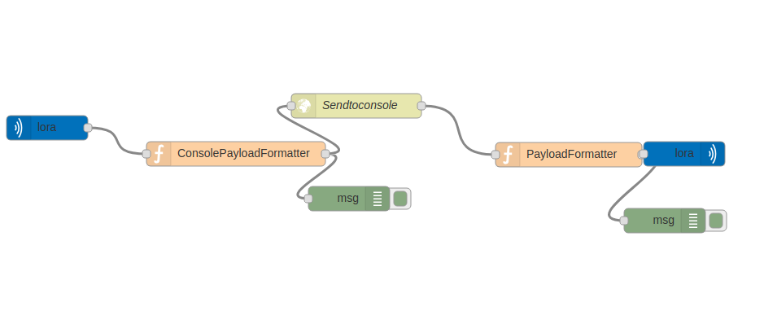

# Node-RED to Python Conversion Documentation
This guide exaplains how to convert a simple node red flow to a python script. This guide uses radiobridge's node-red flow as an example. Download the example code [here](https://github.com/russmin/Node-Red-Python).

## Radiobridge Node-RED Flow


This Node-RED flow has 5 steps.
1. LoRa input node listen for up-links
2. Function to format the payload
3. Send the payload to remote webserver via a HTTPS request. 
4. Function to format the request response to send to the endpoint
5. LoRa endpoint receives data and queues downlink

## Coverting to Python

The python script will replicate the steps of the node-red flow. We will work through the code for each step in the flow.

First we need the download and import the required libraries 
```
import time
import io, json 	
import argparse
import logging
import base64
import binascii
import httplib 
```
These are included in the standard python 2.7.x and 3.x libraries
```
import paho.mqtt.client as mqtt
```
This library will provide the methods to connect to an MQTT broker. This library is not included in standard python library and will need to downloaded into the conduit before running the application.

Issue the command to download the library
```
$ pip install paho-mqtt
```
### Class and Methods

Before we replicate the steps from node-RED flow, we need to set out class variables we will use for the methods in our class.

``` python
isConnected = False     #checks ethernet connection 
isOnMessage = False    #will carry msg payload...empty to begin        
lora_client = mqtt.Client() 
packet = None 						
isJsonEmpty = True 			#keep track of whether file is empty		
jsonFilePath = 'packetStorage.json' #INPUT DESIRED JSON FILE NAME HERE OR LEAVE DEFAULT                     
payloadData = None            # sets the payload data empty
devEUI = None 			     # sets the Deveui as empty to begin with
rbAuthorization = ''        #authorization needed to send https request
```

## **1. LoRa input node listen for up-links**
The ```setLoraClient()``` funciton connects the Lora broker which in this case is the conduit local network server. The ```loraOnConnect()``` is initiated when the lora client connects.
```python
    #connect lora client to localhost
	def setLoraClient(self):
		self.lora_client.connect("127.0.0.1")

	#callback function initiated on on_connect property for lora client
	def loraOnConnect(self, client, userdata, flags, rc):
		print("Lora Client Connection: " + str(rc)) 	#Returns a 0
		self.lora_client.subscribe("lora/+/up", qos=0)
		self.isConnected = True

	#callback function initiated on on_disconnect property for both clients
	def onDisconnect(self, client, userdata, rc):
		self.isConnected = False
		print("The connection has failed.")
```

In this line the lora-client subscribes to lora uplink topic and recieves messages
```python
self.lora_client.subscribe("lora/+/up", qos=0)
```


## **2. Formats the data and prints the data to the debug platform**
```python
	## formats the payload message from the endpoint
    def rbPayloadFormatters(self, msg):
		msgObj = json.loads(msg)
		newMsg = {}
		msgHex = base64.b64decode(msgObj["data"])
		newMsg["payload"] = binascii.hexlify(msgHex)
		newMsg["time"] = msgObj["tmst"]
		newMsg["snr"] = msgObj["lsnr"]
		newMsg["station"] = msgObj["appeui"]
		newMsg["avgsnr"] = msgObj["lsnr"]
		newMsg["lat"] = 0
		newMsg["lng"] = 0
		newMsg["rssi"] = msgObj["rssi"]
		newMsg["seqnumber"] = msgObj["seqn"]
		newMsg["deveui"] = msgObj["deveui"]
		newMsg["authorisation"] = self.rbAuthorization
		return json.dumps(newMsg)
```
This function replicates the *consolePayloadFormatter* node in the Node-Red flow. It takes in the uplink messages and formats and returna json object to send to remote server. it


**The ```OnMessage()``` funtion takes care of the next three steps of the flow. We will break the function in parts**

## **3. Send the payload to remote webserver via a HTTPS request.**
This function is called whenever a new uplink is recieved. 

 ```python
 def onMessage(self, mqtt_client, userdata, msg):
		self.packet = self.rbPayloadFormatters(msg.payload)
		pkt = json.loads(self.packet)
		self.devEUI = pkt["deveui"]
		self.payloadData = pkt["payload"]

		print(self.packet)
		#### HTTP REQUEST GOES HERE ####
		rbConnection = httplib.HTTPSConnection("console.radiobridge.com")
		rbHeaders = {"Content-Type": "application/json", "Accept":"application/json"}
		rbConnection.request("POST", "/uplink_api_callback", self.packet, rbHeaders)
		rbResponse = rbConnection.getresponse()
		rbResponseMsg = rbResponse.read()
```

Calls the payloadformatter funtion, formats the payload and saves the deveui and payload data to the global variables.
```python
self.packet = self.rbPayloadFormatters(msg.payload)
pkt = json.loads(self.packet)
		self.devEUI = pkt["deveui"]
		self.payloadData = pkt["payload"]
``` 
Next is the http request.
```python
#### HTTP REQUEST GOES HERE ####
		rbConnection = httplib.HTTPSConnection("console.radiobridge.com")
		rbHeaders = {"Content-Type": "application/json", "Accept":"application/json"}
		rbConnection.request("POST", "/uplink_api_callback", self.packet, rbHeaders)
		rbResponse = rbConnection.getresponse()
		rbResponseMsg = rbResponse.read()
```
The ```httplib.HTTPSConnection()``` funtion establish a network to the remote server and takes in a string for the host name. ```.request()``` function makes the request and passes the formatted packet data. More infor about using [httplib](https://docs.python.org/2/library/httplib.html). library
```python
rbResponse = rbConnection.getresponse()
rbResponseMsg = rbResponse.read()
```
saves the response. 

## **4. Function to format the request response to send to the endpoint**


```python

	if(rbResponseMsg != ""):
		try:
			##formats the downlink message##
			rbResponseMsg = json.loads(rbResponseMsg)
			newMsg = {}
			msg64 = binascii.unhexlify(rbResponseMsg["payload"])
			newMsg["data"] = binascii.b2a_base64(msg64)
			newMsg["ack"] = "false"
			newMsg["port"] = 1
			newMsg = json.dumps(newMsg)
			print("Radiobridge reply was " + str(rbResponseMsg) + " downlink was 					published")
```
In this section of code, if the response message is not empty and the response message contains downlink data.

### **5. LoRa endpoint receives data and queues downlink**

then the reponse message is formatted correctly to queue the downlink and print 
```python 
self.lora_client.publish("lora/"+ self.devEUI + "/down", newMsg)
```
if the response message does not contain any data the funtion prints the response message to the console and no downlink is published.
```python
		except:
			print('Radiobridge reply was ' + str(rbResponseMsg) + ' downlink did not 					publish')
```
## Other functions


